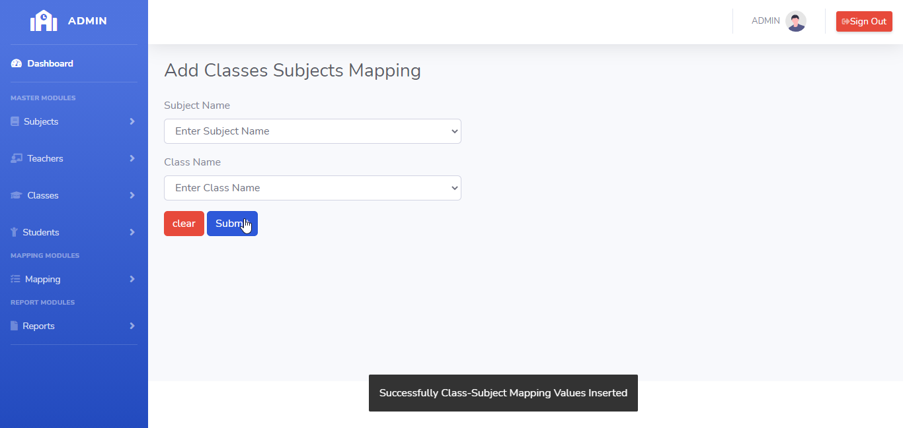
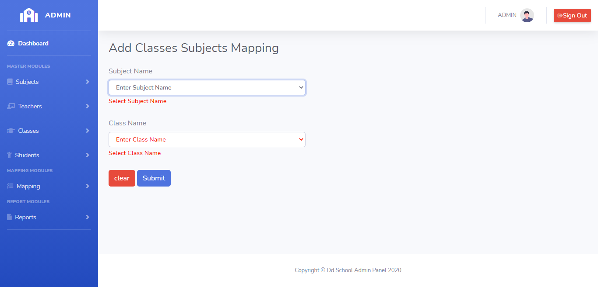
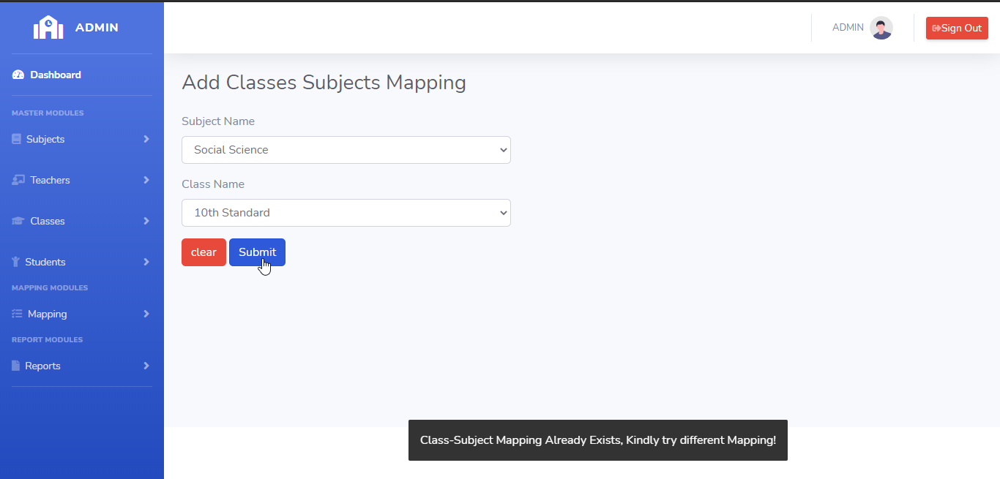

# LearnersAcademy

## About Us

> LearnersAcademy is a web portal school admin panel, which uses the Latest technologies in the Market. 

#### Technologies Used
1. **Java** Used JSP and Servlets for Server Side Scripting
2. **Hibernate** Used to communicate with database
3. **HTML5,CSS**   Used for Design Purpose
4. **JavaScript,JQuery,Bootstrap** Used for Client Side Scripting
5. **MySQL** Used for Storing Data (Database)
6. **Quickup** Used for Kanban and Scrum updates
7. **Git** Used for version control management
8. **Docsify** Used for documentation purpose 

## Git Details

> You can download our LearnersAcademy Source Code by Clicking on this link (https://github.com/Dd141314/simplilearn_phase2_project_school_admin)

> In the Adding Classes-Subjects menu, Submit Button is used to submit the mapped Classes-Subjects values to the database and clear button is for clearing the form.

## How to Add Classes-Subjects Mapping ?

> Admin needs to enter mandatory fields in the add Classes-Subjects form. On clicking the submit button Classes-Subjects Mapping details saved to the database.
 

 

#### Errors & Warnings

The below warning / error message will be displayed to the user in case of any invalid action.
The warning / error messages are self explanatory, here are few examples.

!>**Enter the Class Name**
	- If the user tries to submit in without entering the Class Name.
	
!>**Enter the Subject Name**
	- If the user tries to submit in without entering the Subject Name.
	

!>**Classes-Subjects Already Exists,Kindly try to add different Classes-Subjects**
	- If the user tries to submit the same class name and subject name.
	

   
{docsify-updated}

